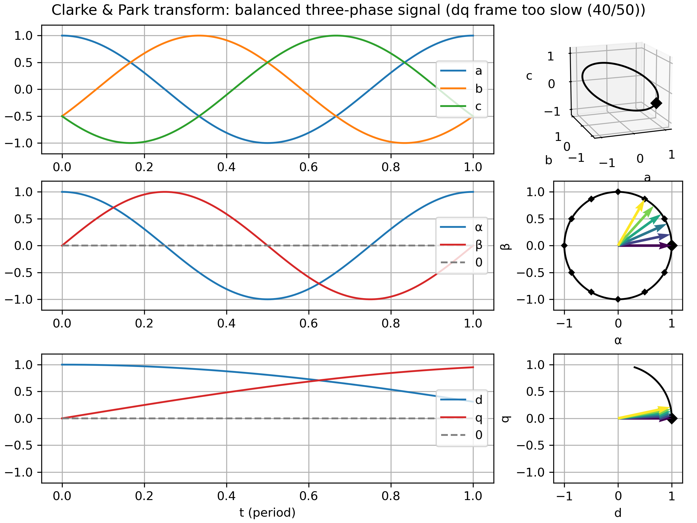

# Pierre’s notebooks

A collection of Jupyter notebooks to share concepts with students and colleagues. In particular, with **interactive graphs** (Matplotlib+[ipywidgets](https://ipywidgets.readthedocs.io/en/stable/))

These notebooks can be run directly in a web browser thanks to [JupyterLite](https://jupyterlite.readthedocs.io/). You can also download each notebook from the `content` directory.

Jupyter Lab interface with all the notebooks: https://pierre-haessig.github.io/pierre-notebooks/lab/

Remark: the setup of ipywidgets in JupterLite (using the pyodide-kernel) is [fragile](https://github.com/jupyter/try-jupyter/issues/54), so that the interactive widgets of these notebook are often broken, unfortunately ☹️. Still, the remaining cells should work fine and the widgets as well if run in a classical local Jupyter environment.

## Direct links to content

(using the simpler interface of the “classical” Jupyter notebook)

### ⚡ Electrical engineering ⚡

1. **Puissances en régime alternatif** (P, Q, S, cosϕ…): [Puissances_alternatif.ipynb](https://pierre-haessig.github.io/pierre-notebooks/notebooks/?path=Puissances_alternatif.ipynb) (in French 🇫🇷)
2. **Frequency regulation** — Simulating the swing equation and the effect of primary reserve (FCR), with an **interactive transient simulation of grid frequency**: 

   - variant with code and formulas [Frequency regulation.ipynb](https://pierre-haessig.github.io/pierre-notebooks/notebooks/?path=Frequency%20regulation.ipynb) 🧑‍💻
   - variant with the interactive simulation only [Frequency regulation nocode.ipynb](https://pierre-haessig.github.io/pierre-notebooks/notebooks/?path=Frequency%20regulation%20nocode.ipynb) 🕹️

   

3. 🔋 **Battery state of charge (SoC) estimation using Kalman filter**: [Kalman filter battery.ipynb](https://pierre-haessig.github.io/pierre-notebooks/notebooks/?path=Kalman%20filter%20battery.ipynb) (archived version at https://hal.science/hal-04701587)

4. **Clarke (αβ) & Park (dq) transforms illustrated**: [Clarke_Park-dq_transforms_plot.ipynb](https://pierre-haessig.github.io/pierre-notebooks/notebooks/?path=Clarke_Park-dq_transforms_plot.ipynb)

   - Illustration when the dq reference frame is moving slightly too slow (40 Hz vs. 50 Hz), making the space vector slowly moving in the dq frame: 

