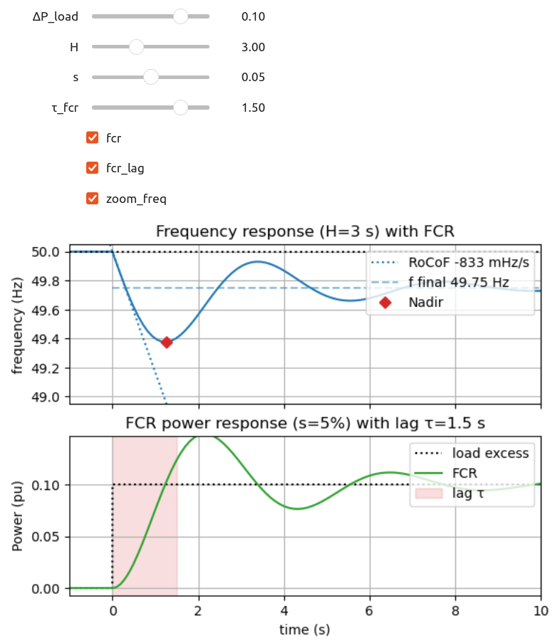

# Pierre’s notebooks

A collection of Jupyter notebooks to share concepts with students and colleagues. In particular, with **interactive graphs** (Matplotlib+[ipywidgets](https://ipywidgets.readthedocs.io/en/stable/))

These notebooks can be run directly in a web browser thanks to [JupyterLite](https://jupyterlite.readthedocs.io/). You can also download each notebook from the `content` directory.

Jupyter Lab interface with all the notebooks: https://pierre-haessig.github.io/pierre-notebooks/lab/

## Direct links to content

### ⚡ Electrical engineering ⚡

1. **Puissances en régime alternatif** (P, Q, S, cosϕ…): [Puissances_alternatives.ipynb](https://pierre-haessig.github.io/pierre-notebooks/retro/notebooks/?path=Puissances_alternatives.ipynb) (in French 🇫🇷)
2. **Frequency regulation** — Simulating the swing equation and the effect of primary reserve (FCR): [Frequency_regulation.ipynb](https://pierre-haessig.github.io/pierre-notebooks/retro/notebooks/?path=Frequency_regulation.ipynb), with an **interactive transient simulation of grid frequency**: 

